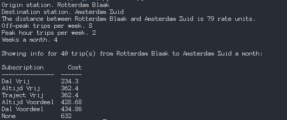

# NS Abonnement Calculator

The NS Abonnement Calculator is a tool to help you plan your subscriptions based on the kind of trips you have to make every month.

The tool prompts you for the following:
* an origin
* a destination
* the number of times you plan on traveling on this route in a week during off-peak hours
* the number of times you plan on traveling on this route each week during peak hours
* the number of weeks per month

After that, it returns a table of costs for each subscription sorted by ascending price. This way, you can decide which subscription to buy!

## Usage

```bash
python ns.py
```

## Screenshot



## Dependences
* tabulate
* pandas
